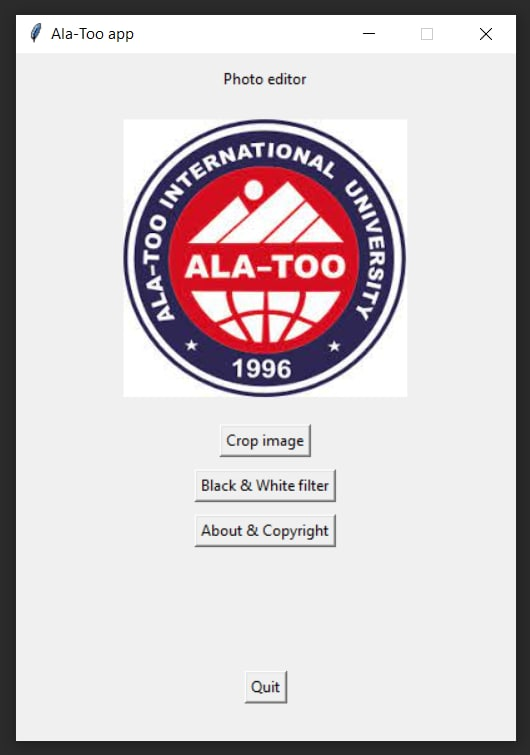
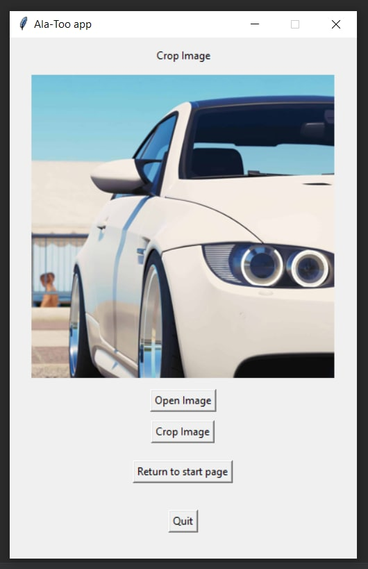
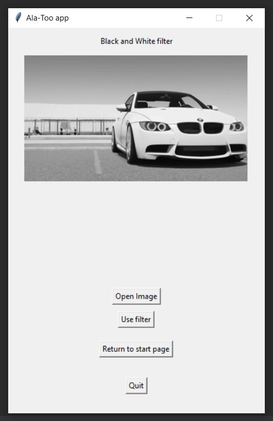
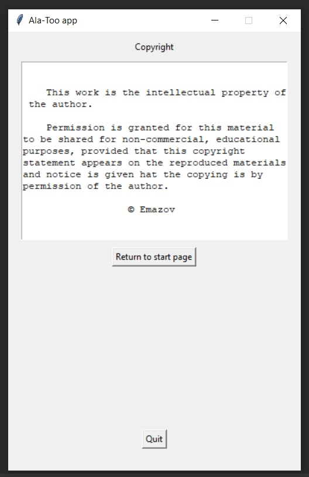

FiltersApp
===============
___
## Short Information

This python app is used to add filters and image processing



## Setup

1. Install requirements

```
pip install -r requirements.txt
```

2. Run script

```
python main.py
```

##Filters and Processes 

###1. Crop Image
This process crops the image for 1080 x 1080



###2. Black and White filter
This filters the image to Black and White


##Copyright page



